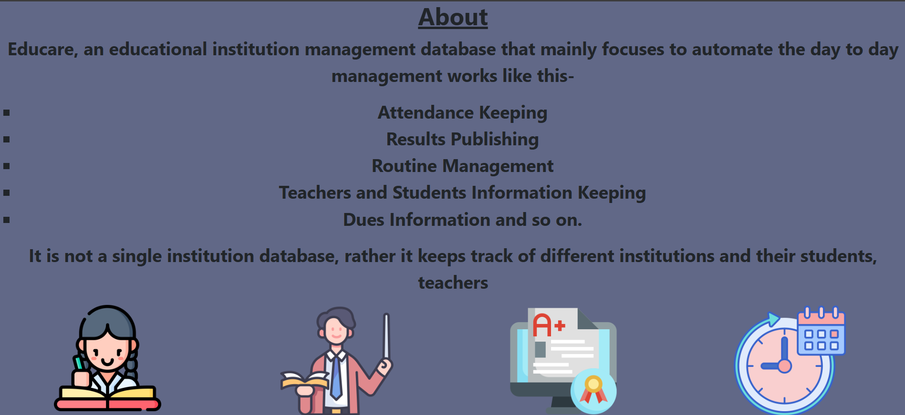

# Educare: Multiple School Management Platform

---

## Overview

This is the backend of EduCare. Educare is a platform for managing multiple schools with different roles and functionalities. It allows communication and management for institutions, teachers, students, guardians, and administrators.

---

## Tech Stack

### Frontend
- **React** (Framework)
- **HTML** and **CSS** (Styling)

### Backend
- **Node.js** and **Express.js** (Server-side)
- **Oracle DBMS** (Database)

---

## Features

### Common (Accessible Without Login)
- View added institutions.
- Learn about the platform.

### Roles and Functionalities

#### **Admin**
- Add and manage institutions.

#### **Institution**
- Add teachers and students to their respective classes.
- Create routines based on teacher availability.
- Manage fees and charges for students (e.g., fines for misconduct).

#### **Teacher**
- View assigned classes, routines, and student lists.
- Mark attendance for a particular class on a specific day.
- Enter marks for exams.

#### **Student**
- View marks, attendance, routines, dues, and results.

#### **Guardian**
- View a child's results, attendance, and payment information.
- Update payment information by submitting a transaction ID.

---

## Images

    
    
    

